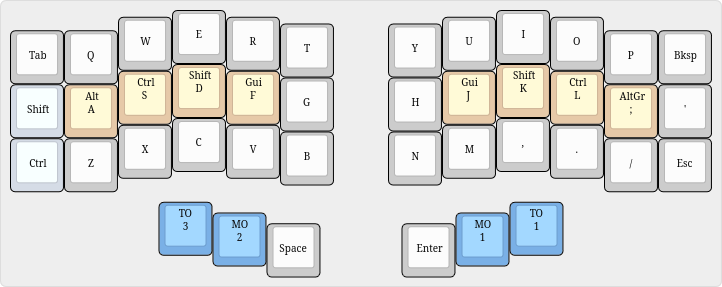
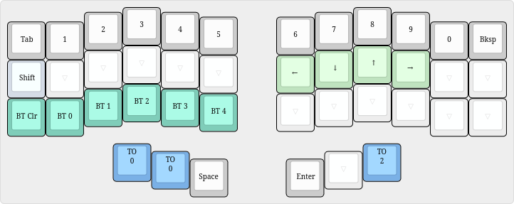
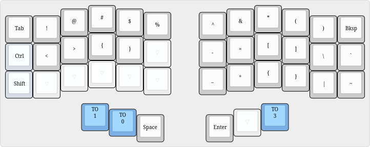
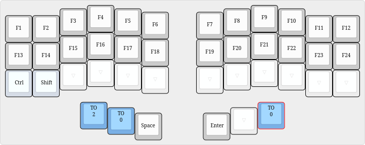

# Wireless 6 column corne firmware/layout

This is my layout and files for my 6 layer wireless corne keyboard.

If you want this exact firmware you can download the file from the latest action in the actions tab but I recommend making your own, see [Typeractive's documentation](https://docs.typeractive.xyz/build-guides/corne-wireless/firmware). You can use [keymap editor](http://nickcoutsos.github.io/keymap-editor) to make changes to your repo and push them and the github actions will automatically build your firmware.

## layer 0

## layer 1

## layer 2

## layer 3

